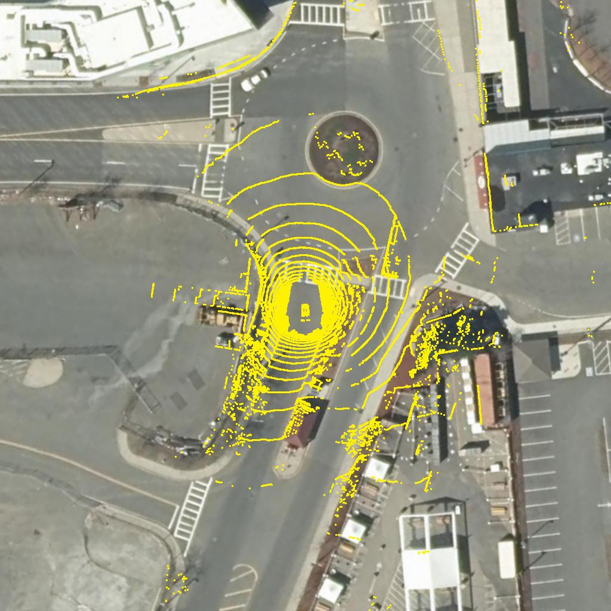
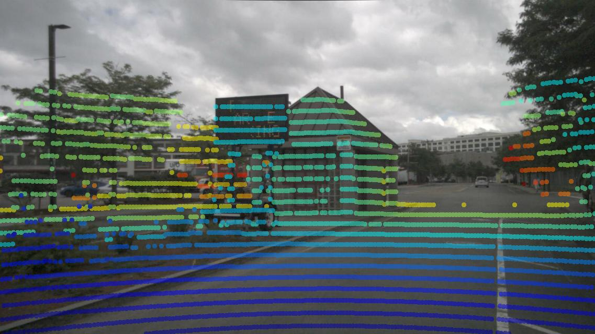
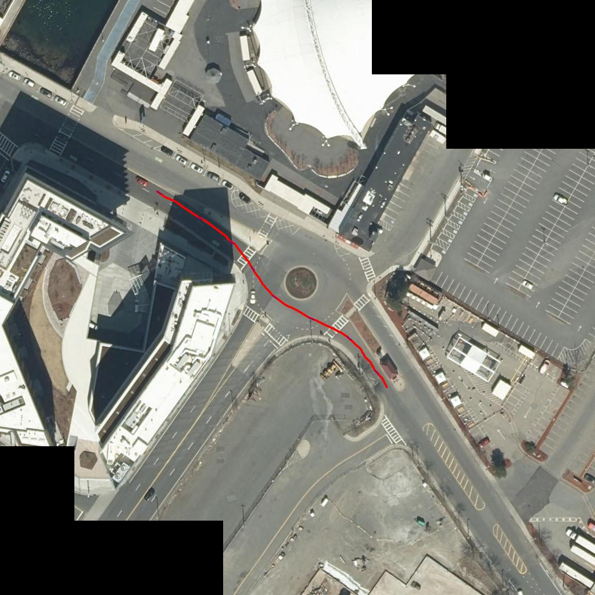

# Cross-View Geolocalization Data

[](https://opensource.org/licenses/MIT) [](https://pypi.python.org/pypi/cvgl_data/)

> A library for managing datasets for cross-view geolocalization (CVGL).

#### Main features:
1. :file_folder:&nbsp;&nbsp;&nbsp;&nbsp;&nbsp; Define a common data format for different datasets.
2. :file_folder::arrow_left: Provide code for (downloading and) converting datasets to this format.
3. :file_folder::arrow_right: Provide code for loading data samples from this format.
4. :straight_ruler:&nbsp;&nbsp;&nbsp;&nbsp;&nbsp;&nbsp;Provide improved ground-truth for all datasets

#### Installation
```
pip install cvgl_data
```

#### Content
1. [Usage](#usage)
    1. [Downloading and converting data](#file_folderarrow_left-downloading-and-converting-data)
    2. [Loading data from disk](#file_folderarrow_right-loading-data)
    3. [Loading data from tiled web maps](#earth_africaarrow_right-loading-data-from-tiled-web-maps)
    4. [Visualization](#visualization)
2. [Pseudo-labelled ground-truth](#straight_ruler-ground-truth)
3. [Dataset format](#file_folder-format)
4. [Example: Integration with PyTorch](#example-integration-with-pytorch)
5. [Notes](#notes)

#### Paper
If you find this library useful for your research, please consider citing:
```
@InProceedings{Fervers_2023_CVPR,
    author    = {Fervers, Florian and Bullinger, Sebastian and Bodensteiner, Christoph and Arens, Michael and Stiefelhagen, Rainer},
    title     = {Uncertainty-Aware Vision-Based Metric Cross-View Geolocalization},
    booktitle = {Proceedings of the IEEE/CVF Conference on Computer Vision and Pattern Recognition (CVPR)},
    month     = {June},
    year      = {2023},
    pages     = {21621-21631}
}
```

## Usage

### :file_folder::arrow_left: Downloading and converting data

The following bash command converts the [Argoverse V1](https://www.argoverse.org/av1.html) dataset in the specified folder to the *cvgl-data* format:

```bash
python3 scripts/prepare/argoverse_v1 --path ~/argoverse-v1 --min-pixels 640 # Downsample
```

See [./scripts/prepare](./scripts/prepare) for all supported datasets. Some datasets have to be downloaded manually (if prompted by the script).

### :file_folder::arrow_right: Loading data

#### 1. Loading meta-data

The following loads an index of a dataset from disk with meta-data such as camera parameters, paths to image files, etc. This is fast and excludes image or point cloud files which are later loaded on-demand.

```python
>>> import cvgl_data
>>> scenes = cvgl_data.ground.load("~/argoverse-v1")
```

Each dataset consists of a list of scenes. To inspect the sensors used in a scene:

```python
>>> scene = scenes[0]
>>> scene
{
  camera: {
    ring_front_center: {
      intr: np.ndarray,
      name: "ring_front_center",
      resolution: (640, 1024),
      timestamps: np.ndarray(shape=(901)),
    },
    # ...
  },
  dataset: "argoverse-v1",
  ego_to_world: {
    timestamps: np.ndarray(shape=(6877)),
  },
  geopose: {
    timestamps: np.ndarray(shape=(6877)),
  },
  lidar: {
    all: {
      name: all,
      timestamps: np.ndarray(shape=(300)),
    },
  },
  location: "MIA",
  scene_name: "00c561b9-2057-358d-82c6-5b06d76cebcf",
}
```

A scene can either contain sensors with 
- **timestamped sequences** of measurements (e.g. a video consisting of multiple frames as in [Argoverse V1](https://www.argoverse.org/av1.html)), or
- **unordered sets** of measurements (e.g. ground panoramas and matching aerial images as in [CVUSA](https://mvrl.cse.wustl.edu/datasets/cvusa/)). In this case, the `timestamp` field acts as an id for matching sensor data.

Each sensor in a scene is represented by a loader object responsible for retrieving the corresponding data from disk.

#### 2. Loading data at timestamp

Once the meta-data is loaded, we can choose a scene and timestamp and load the corresponding data from disk. Since sensor setups often capture data asynchronously, the sparse sensor measurements have to be interpolated between subsequent measurements. Each loader object comes with a method `loader.load(timestamp: int)` that loads the necessary data from disk and performs interpolation (if possible) for the requested timestamp. E.g. to load data from all sensors for a given timestamp:

```python
>>> timestamp = scene.camera["ring_front_center"].timestamps[0] # Choose the first camera timestamp
>>> frame = scene.load(timestamp)
>>> frame
{
  camera: {
    ring_front_center: {
      cam_to_ego: cosy.Rigid,
      image: np.ndarray(shape=(640, 1024, 3)),
      intr: np.ndarray,
      name: "ring_front_center",
      timestamp: 315969629022515,
    },
    # ...
    timestamp: 315969629022515,
  },
  dataset: "argoverse-v1",
  ego_to_world: {
    timestamp: 315969629022515,
    transform: cosy.Rigid,
  },
  geopose: {
    bearing: 177.389,
    latlon: (25.798512, -80.194962),
    timestamp: 315969629022515,
  },
  lidar: {
    all: {
      name: "all",
      points: np.ndarray(shape=(81522, 3)),
      timestamp: 315969629022515,
    },
    points: np.ndarray(shape=(81522, 3)),
    timestamp: 315969629022515,
  },
  location: "MIA",
  name: "argoverse-v1-00c561b9-2057-358d-82c6-5b06d76cebcf-315969629022515",
  scene_name: "00c561b9-2057-358d-82c6-5b06d76cebcf",
  timestamp: 315969629022515,
}
```

The meta-data object `scene` and the timestamped data object `frame` have the same tree structure based on the grouping of sensors.

### :earth_africa::arrow_right: Loading data from tiled web maps

In addition to loading pre-defined samples from an existing dataset, we can also load virtual data samples from a tiled web map using the library [tiledwebmaps](https://github.com/fferflo/tiledwebmaps). We first choose a tileloader from which aerial images will be fetched (see [examples](https://github.com/fferflo/tiledwebmaps#finding-tile-providers)):

```python
>>> import tiledwebmaps as twm
>>> tileloader = ...
```

We can then define a virtual scene that provides map data and corresponding geo-poses, and load a data sample from it:

```python
>>> twm_scene = cvgl_data.load_tiledwebmaps(tileloader, name="name-of-tileloader", zoom=20)
>>> twm_frame = twm_scene.load(
>>>     latlon=frame.geopose.latlon, # Load map data centered on the geo-pose of our previously loaded vehicle frame
>>>     bearing=frame.geopose.bearing,
>>>     meters_per_pixel=0.1,
>>>     shape=(512, 512),
>>> )
>>> twm_frame
{
  dataset: "name-of-tileloader",
  geopose: {
    bearing: 177.389,
    latlon: (25.7985, -80.195),
    timestamp: 0,
  },
  location: "unknown-location",
  map: {
    image: np.ndarray(shape=(512, 512, 3)),
    meters_per_pixel: 0.200000,
    name: "name-of-tileloader",
    timestamp: 0,
  },
  name: "name-of-tileloader-z20-lat25.7985-lon-80.195-b177.389",
  scene_name: "name-of-tileloader",
  timestamp: 0,
}
```

### Visualization

#### 1. Individual frames

The script [`draw_frames`](./scripts/draw_frames) can be used to draw individual data frames by projecting the lidar points into ground and aerial images. This requires a file `config.yaml` that contains the paths to all datasets and definitions of tileloaders (see [data/config.yaml](data/config.yaml) for an example).

*Example:*<br>
`python3 draw_frames --output ~/frames --num 70 --dataset nuscenes --config config.yaml --tileloader massgis21 --location boston-seaport --aerial-point-radius 2.5`

*Output (Map data: [MassGIS](https://www.mass.gov/orgs/massgis-bureau-of-geographic-information), vehicle data: [Nuscenes](https://www.nuscenes.org/)):*<br>
 

#### 2. Trajectories

The script [`draw_trajectories`](./scripts/draw_frames) can be used to draw trajectories on aerial images.

*Example:*<br>
`python3 draw_trajectories --output ~/trajectories --dataset nuscenes --config config.yaml --tileloader massgis21 --downsample 2 --radius 2 --stride 1.0 --per-scene --location boston-seaport`

*Output (Map data: [MassGIS](https://www.mass.gov/orgs/massgis-bureau-of-geographic-information), vehicle data: [Nuscenes](https://www.nuscenes.org/)):*<br>


## :straight_ruler: Ground-truth

The original ground-truth geo-poses of datasets are often inaccurate. [In our paper](https://fferflo.github.io/projects/vismetcvgl23/), we use a pseudo-label approach to produce more accurate ground-truth. The pseudo-labelling also yields outlier-scores that can serve to indicate invalid data samples (i.e. when the vehicle is travelling through a tunnel, when the aerial and ground data are out-of-date, or when the pseudo-labelling failed).

Download the pseudo-labels from the following link (currently without Kitti and Kitti-360):<br>
[https://drive.google.com/file/d/1DOHekyqi0FtLh97YYR6_EngciGpKr1Pc](https://drive.google.com/file/d/1DOHekyqi0FtLh97YYR6_EngciGpKr1Pc)

**The pseudo-labels retain the license of the original datasets.**

The pseudo-label files also follow the *cvgl-data* format and can be integrated without replacing any files in the original dataset directories. After downloading and extracting the pseudo-labels, they can be included when loading a dataset as follows:

```python
>>> scenes = cvgl_data.ground.load("~/argoverse-v1", updates=["/path/to/extracted/pseudolabels/"])
```

When `updates` is passed, the function will first check all provided paths when looking for a file (e.g. `geopose.npz` for pseudo-labels), and only fallback to the original file if no update was found. The provided path should contain one folder per dataset and follow the *cvgl-data* format per dataset.

## :file_folder: Format

*cvgl-data* defines the following format for datasets:

```
|-- {dataset_name}                            # the root folder's name specifies the dataset name
  |-- LICENSE                                 # ID and link to the license of the dataset
  |-- {scene_name}...                         # every scene is stored in a separate folder
    |-- camera
      |-- {camera_name}...                    # every camera is stored in a separate folder
        |-- images                            #
          |-- {timestamp}.{jpg|png|...}...    # one camera image per captured timestamp
        cam_to_ego.npz                        # a list of transformations from camera to ego coordinates per timestamp
        timestamps.npz                        # a list of all timestamps for which a camera image is available
        config.yaml                           # constant configuration parameters over all timestamps: e.g. intr, cam_to_ego, resolution
    |-- lidar
      |-- {lidar_name}...                     # every lidar sensor is stored in a separater folder
        |-- points                            #
          |-- {timestamp}.npz...              # one point cloud per captured timestamp (in ego coordinates)
        |-- timestamps.npz                    # a list of all timestamps for which a point cloud is available
        |-- config.yaml                       # constant configuration parameters over all timestamps: (currently none)
    |-- map
      |-- {map_name}...                       # every orthographic map is stored in a separate folder
        |-- images                            #
          |-- {id}.{jpg|png|...}...           # one image per timestamp/ id
        |-- meters_per_pixel.npz              # a list of meters_per_pixel per timestamp/ id
        |-- config.yaml                       # constant configuration parameters over all timestamps/ ids: resolution, meters_per_pixel
    |-- odometry                              #
      |-- angular_velocity.npz                # a list of angular velocities and corresponding timestamps (in ego coordinates)
      |-- linear_acceleration.npz             # a list of linear accelerations and corresponding timestamps (in ego coordinates)
      |-- linear_velocity.npz                 # a list of linear velocities and corresponding timestamps (in ego coordinates)
    |-- ego_to_world.npz                      # a list of transformations from ego to world coordinates and corresponding timestamps
    |-- geopose.npz                           # a list of geo-poses (latlon, bearing) and corresponding timestamps
    |-- outlier_scores.npz                    # a list of outlier scores (indicating whether a given data-sample is invalid) and corresponding timestamps
    |-- config.yaml                           # dataset configuration parameters: dataset (name), location (e.g. New York)
```

The format uses npz files for numerical data, yaml files for configuration data and allows for common image file-types.

## Example: Integration with PyTorch

```python
import torch, cvgl_data
import tiledwebmaps as twm
from torch.utils.data import Dataset, DataLoader
import numpy as np

# Load a vehicle dataset and define a tileloader
scenes = cvgl_data.load("/path/to/dataset")
tileloader = ...

# Define a PyTorch dataset that loads paired ground and aerial data
class MyDataset(Dataset):
    # scene_timestamps_pairs: list of (scene, timestamps) defining which timestamps should be sampled per scene
    def __init__(self, tileloader, scene_timestamps_pairs):
        # Flatten scene_timestamps_pairs into a list of (scene, timestamp)
        self.scene_timestamp_pairs = []
        for scene, timestamps in scene_timestamps_pairs:
            self.scene_timestamp_pairs.extend([(scene, timestamp) for timestamp in timestamps])

        self.twm_scene = cvgl_data.load_tiledwebmaps(tileloader, name="name-of-tileloader", zoom=20)

    def __len__(self):
        return len(self.scene_timestamp_pairs)

    def __getitem__(self, idx):
        # Load vehicle data
        scene, timestamp = self.scene_timestamp_pairs[idx]
        frame = scene.load(timestamp)

        # Load aerial data
        twm_frame = self.twm_scene.load(
            latlon=frame.geopose.latlon,
            bearing=frame.geopose.bearing,
            meters_per_pixel=0.2,
            shape=(512, 512),
        )

        # Retrieve the data from frame+twm_frame that the model takes as input. E.g.:
        ground_images = [np.copy(camera.image) for camera in frame.camera.values()]
        aerial_image = np.copy(twm_frame.map.image)

        return ground_images, aerial_image

scene_timestamps_pairs = []
for scene in scenes:
    # Retrieve timestamps of the first camera
    timestamps = scene.camera.values()[0].timestamps

    # Keep only those timestamps where data for all sensors is available (i.e. between first and last measurement per sensor)
    timestamps = cvgl_data.intersect_timestamps(timestamps, cvgl_data.get_all_timestamps(scene))

    scene_timestamps_pairs.append((scene, timestamps))

dataset = MyDataset(tileloader, scene_timestamps_pairs)
dataloader = DataLoader(dataset, batch_size=4, shuffle=True, num_workers=4)
# cvgl_data releases the GIL for all operations, such that multiple workers can fetch data concurrently
```

## Notes

- The [GIL](https://en.wikipedia.org/wiki/Global_interpreter_lock) is released for all operations, such that multiple calls can be made concurrently, e.g. when using this library from a multi-threaded data-loader.
- We use the following coordinate system conventions:
    - Ego: x, y, z = forward, left, up
    - Camera: x, y, z = right, down, forward
